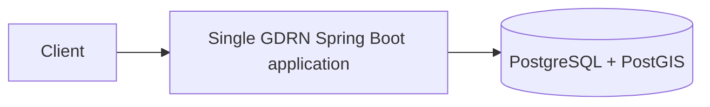

# GDRN architecture foundation

## Objective and current scope

Global Disaster Response Network is a university simulation of disaster response
coordination. It is not an operational emergency response system. The repository
currently provides the foundation plus P01 Identity/login, C1 Disaster and B1/B2 Reporting: one Java 21 Spring Boot
application, database infrastructure, technical endpoints, tests, Docker and CI.
Plain Java Identity `User`, `EmailAddress`, `Role` and their unit tests also exist.
P01 adds login/me, user/credential persistence and the login SPA. C1 adds the Disaster
lifecycle, E03–E06, V3 persistence, published query contract and S05. Rescue remains unimplemented; see [handoff C1](../handoffs/C1.md).

B1/C1 integration (2026-10-09): E07–E09 now run with centralized JWT security and
Flyway V4 after Disaster V3. Reporting stores WGS84 geography through an explicit
JDBC data mapper. Citizen ownership is checked in the application and SQL predicates;
report detail never queries Rescue. E03/E08 list count/items share a REPEATABLE READ
snapshot.
See [B1 handoff](../handoffs/B1.md), [integration results](../handoffs/B1-C1-integration.md)
and [ADR 007](../adr/007-reporting-postgis-data-mapper.md).

B2 branch (2026-10-10, pending review/merge) adds E10/E11, radius filtering and
ReportingQuery on V5; Swagger publishes E01–E11. S01/S05 exist; Reporting UI belongs
to B3/C2. See [B2 handoff](../handoffs/B2.md) for acceptance evidence.

UI01-A integrated in `78f164b` (2026-10-10): shared Crisis Command tokens/layout,
form/state primitives and S01 styling. API/auth/module boundaries did not change.
S05-specific redesign belongs to UI01-C1. Current task/merge status is maintained
in [progress](../phase1-progress.md), not inferred from historical handoff wording.

`GDRN_CODEX_PROJECT_CONTEXT.md` is preserved as the long-term project context. Its
JWT, API examples, proposed tables and completed Phase 1 rubric describe future
work. The [three-week MVP plan](../PROMPTS_PHA_1_4_NGUOI.md) narrows implementation to
Identity/Disaster/Reporting/Rescue and six basic SPA screens. Resource/Alert, separate
RescueRequest, Geo risk, and the larger context API list remain product backlog.
[P00 HTTP/OpenAPI](../api/phase1-contract.md) defines exactly 15 planned operations;
[module contracts and migration ledger](phase1-module-contracts.md) define the future
Rescue → Reporting → Disaster dependency. DisasterQuery is implemented by C1;
ReportingQuery is implemented in B2; see [B2 handoff](../handoffs/B2.md) for merge status.
[ADR 005](../adr/005-phase1-mvp-auth-frontend.md) proposes JWT memory-only (reload needs
login), no refresh and CITIZEN/AUTHORITY with React/TypeScript/Vite. ADR 004 remains a
future event proposal, not an MVP event bus. See [progress](../phase1-progress.md)
and [P00 handoff](../handoffs/P00.md) for review and implementation gates.

## Architecture and deployment

Phase 1 uses a Modular Monolith with DDD concepts and Hexagonal/Clean Architecture.
One deployable application and one PostgreSQL/PostGIS instance keep deployment and
transactions local. Modules provide logical boundaries, not separate services.
DDD starts with requirements, language and business invariants; there are no
invented aggregates or generic base entities in this foundation.



The main application, shared technical configuration, Identity/Disaster/Reporting slices,
login SPA, S05 and remaining module package-info files currently exist. The responsibilities below include the
long-term backlog; only the four MVP modules are scheduled for business implementation.

| Package under `com.gdrn` | Planned responsibility |
| --- | --- |
| identity | Authentication, authorization, users and roles |
| disaster | Disaster lifecycle and management |
| reporting | Citizen incident reports |
| rescue | Requests, teams and missions |
| resource | Emergency resources and allocations |
| alert | Emergency alerts |
| geo | Geographic operations and spatial risk functionality |
| shared | Small, justified technical/shared concerns; currently security and OpenAPI configuration |

## Future module structure

Create packages only when a use case requires them:

```text
<module>/
  api/
    controller/
    request/
    response/
  application/
    command/
    query/
    usecase/
    port/
  domain/
    model/
    service/
    event/
    repository/
  infrastructure/
    persistence/
      entity/
      repository/
      adapter/
      mapper/
    configuration/
```

## Dependencies and request flow

API → Application → Domain. Infrastructure → Application/Domain ports.
At runtime: HTTP → controller → use case → domain/port → infrastructure adapter → DB.
An adapter implements the inner interface; the inner layer never imports it.

- **Domain:** plain Java; no Spring, JPA, Hibernate, PostgreSQL/JDBC, Jackson,
  HTTP, application, API or infrastructure dependencies. No `@Entity`, `@Table`,
  `@Repository`, `@Service` or `@RestController` annotations.
- **Application:** commands, queries, use cases and ports. May depend on domain;
  no outer-layer or persistence implementation dependencies and no HTTP details.
- **API:** HTTP DTOs, validation and mapping, invoking use cases. No business logic,
  direct persistence access, or repository-port calls that bypass use cases.
- **Infrastructure:** database/framework integration and mappings; JPA models stay
  separate from domain models and REST representations.
- **Modules:** never import another module's infrastructure, entities, repositories,
  adapters or internal implementations. Introduce explicit published application
  contracts/facades, ports or in-process events only with a real use case.

ArchUnit automatically imports production code and enforces domain independence,
application isolation, API persistence isolation and cross-module infrastructure
isolation. Empty selections remain permitted for absent packages; existing business
classes are checked. These four rules are not proof that every cross-module call
uses the published contract: review public-contract usage and domain semantics as
part of the owning use case. DisasterQuery and ReportingQuery are implemented.

## Database strategy

Use one PostgreSQL 16/PostGIS 3.5 database with Flyway owning schema evolution.
Hibernate validates schema; it never creates/updates it. Open Session in View is off.
`V1__enable_postgis.sql` enables the extension only. P01 V2 creates identity_users
and identity_credentials with an internal FK; demo data comes from a controlled
profile, never migration SQL. C1 V3 creates `disasters` with lifecycle, coordinate,
enum and version constraints plus list indexes. B1 V4 creates reporting_reports with
WGS84 geography, initially PENDING-only constraints and stable list indexes. B2 V5
replaces those lifecycle constraints, adds decision/withdrawal metadata and internal
version, and creates a partial GiST index over visible report locations. V4 is immutable.
Atomic conditional UPDATE checks version/PENDING/not-withdrawn; zero affected rows
means a concurrent transition conflict. E08 retains its REPEATABLE READ snapshot.
See [ADR 008](../adr/008-reporting-decisions-and-query-contract.md).
Domain models contain no JPA annotations. PostGIS itself supplies extension
objects and Flyway supplies its history table; neither is a business schema.
The local PostGIS image may pre-enable the extension, so the migration is idempotent.
The local database owner can install extensions; future restricted deployments
must arrange extension privileges or provision PostGIS before migration.

Requirements → Domain Model → Persistence Model → Database Schema → Flyway Migration.
No database-first business design without a specific future justification. Add
Hibernate Spatial only when actual mapped spatial attributes require it; SQL verifies
PostGIS today through the Reporting JDBC mapper without an unused ORM spatial dependency.

## Technical HTTP and security foundation

Liveness checks application availability; readiness also checks database connectivity.
The Docker healthcheck uses `/actuator/health/readiness`; see [ADR 006](../adr/006-foundation-readiness.md).
Only the aggregate health and exact liveness/readiness paths are public; direct
component health paths are denied.

Actuator exposes health only, with details hidden. GET access to health, OpenAPI
and Swagger assets is public for development. P01 allows POST /api/auth/login and
GET /api/auth/me for CITIZEN/AUTHORITY. C1 adds Disaster reads for both roles and
Disaster POST/PATCH for AUTHORITY; Reporting POST/DELETE are CITIZEN-only,
verification PATCH is AUTHORITY-only and GET is CITIZEN/AUTHORITY with application
ownership. Other unimplemented routes remain denied. Spring Security
Resource Server/Nimbus verifies HS256/issuer/audience/time/required claims; key is
environment-only. No generated user, Basic/form/cookie auth, registration or refresh.
CSRF ignores /api/** for Bearer-only auth; other paths retain protection. Session
creation is stateless and request caching is off. JSON errors and no-store headers
are consistent. Swagger exposes E01–E11 via checked-in Identity, Disaster and Reporting contract
slices; future modules must extend them as their real controllers merge.

API extracts UUID and role from verified Jwt into plain application arguments;
IdentityService uses account/password/token ports, JPA/BCrypt/Nimbus are outer
adapters. Demo bootstrap is profile-gated and transactional; unique email plus
ON CONFLICT DO NOTHING preserves existing account data on concurrent reruns.

React/TypeScript/Vite S01 confirms login with E02. JWT is memory-only, reload requires
login, logout/401/expiry clear session and per-user state. Feature route exports
register only implemented pages. S05 exports `/operations/disasters` for AUTHORITY
with real E03–E06 list/detail/create/edit/resolve flows. See [P01 setup](../P01_LOCAL.md).
UI01-A uses shared CSS tokens and local SVG without a UI framework or CDN. Feature
owners consume these primitives and export routes from `features/**/routes.tsx`;
they do not duplicate auth/client/theme. New shared abstractions require a real consumer.

## Testing and CI

`mvnw test` runs domain/application/configuration tests and ArchUnit through Surefire without Docker. `mvnw verify` also runs
Failsafe's `GdrnApplicationIT` and `ReportingIT` using isolated PostGIS Testcontainers and real HTTP
server. It verifies application startup, Flyway history, PostGIS spatial behavior,
public technical endpoints and denied requests, readiness refusal and a real
database outage/recovery while liveness stays UP. Missing Docker fails integration
tests; nothing is silently skipped. Test datasource values come from the container,
not `.env`. JUnit 5 and Mockito arrive through Spring Boot Test.

Future domain tests use plain Java; application tests mock ports; persistence and
important API/security tests use Testcontainers. CI on pushes and pull requests
sets up Java 21, runs clean verify, validates Compose, builds and starts the Docker
stack and smoke-tests health, both probes, OpenAPI and Swagger before cleanup.
`scripts/dev.ps1` provides the same local lifecycle, retains database volumes on
shutdown and never overwrites an existing `.env`.
Docker image assembly skips executing tests because Testcontainers requires a
Docker daemon; the preceding CI verify is the test gate.
The frontend CI job pins Node from `.nvmrc` and runs npm ci/typecheck/test/build.
Playwright real login/S05/UI01 tests run locally with env credentials; CI browser
execution and frontend production container/proxy remain A2/X2 work. Test results
are dated evidence in handoffs, not guarantees for a later commit.

## Phase 1 and Phase 2

Reporting UI, Rescue, the expanded A1 security audit and benchmark workloads remain
planned; P01/C1/B1/B2 and shared UI01-A are implemented.
Internal events may be introduced in-process; delivery, transaction timing and
failure semantics are not decided or implemented. Examples such as
`IncidentReportSubmitted`, `DisasterDetected`, `DisasterEscalated`, `RescueRequested`,
`RescueTeamAssigned` and `EmergencyAlertCreated` are documentation only.

No microservices, brokers, Redis, Kubernetes, API gateway, service discovery,
distributed transactions/tracing, separate module databases or cloud infrastructure
are introduced. Phase 2 improvements need observed quality-attribute problems,
an ADR and comparable before/after benchmarks. No performance gain is claimed.

## Sources for dependency choices

- [Spring Boot 3.5 reference](https://docs.spring.io/spring-boot/3.5/reference/index.html)
- [Springdoc compatibility matrix: Boot 3.5 and Springdoc 2.8](https://springdoc.org/v2/)
- [PostGIS Docker images](https://github.com/postgis/docker-postgis)
- [Testcontainers database integration](https://java.testcontainers.org/modules/databases/)

Versions are pinned in `pom.xml`, wrapper properties and Docker files. Review patch
updates and upstream support before any deployment beyond this course environment.
